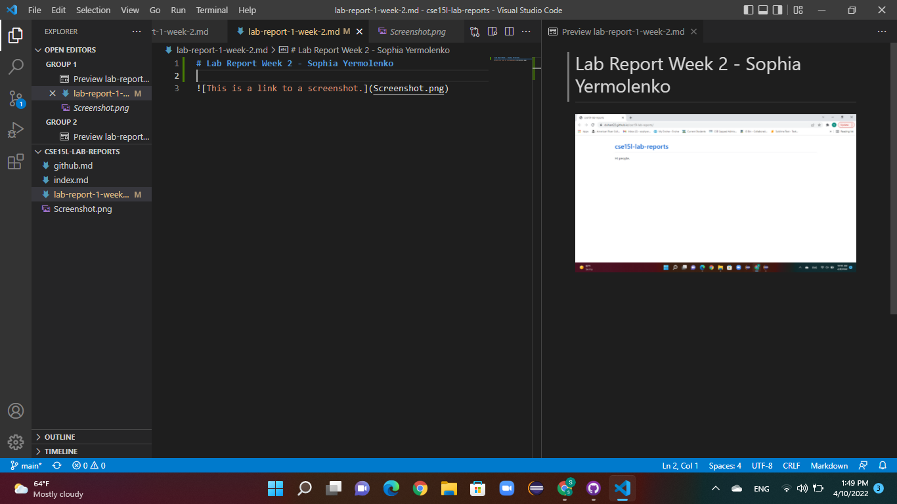
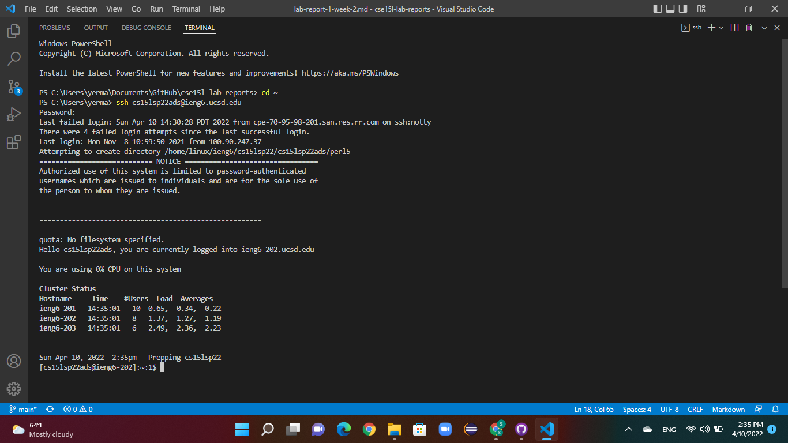
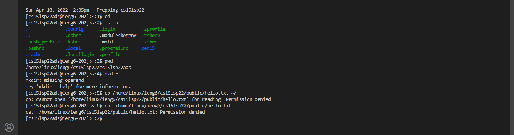
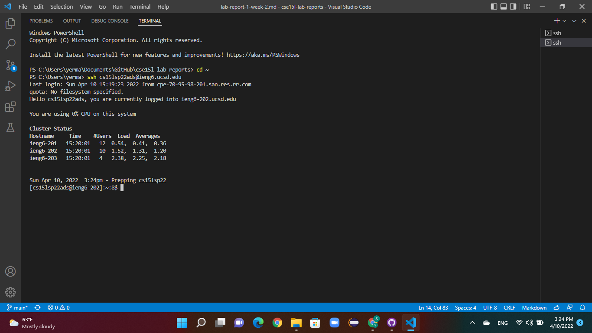
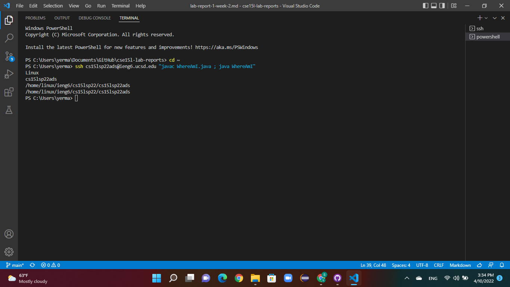

# Lab Report Week 2 - Sophia Yermolenko
## Topic: Remote Access

### 1. Installing VScode. 

In order to install Visual Studio Code, go to https://code.visualstudio.com/, and follow the instructions to download and install it on your computer. Since I have a Windows operating system, I followed the instructions for installation for this particular system.

This is a screenshot of VScode open. 

### 2. Remotely Connecting

Since I use Windows, I first installed a program called OpenSSH. Next, I opened a terminal in VSCode and entered `ssh cs15lsp22ads@ieng6.ucsd.edu`.
After entering my password, my terminal was connected to a computer in the CSE basement.

This is a screenshot of of the output.

### 3. Trying Some Commands

I typed in `ls -a` that showed me a list of all the directories in the file space `cs15lsp22ads`. I also typed `pwd` in order to print the current working directory. I tried a total of 6 commands which are shown in the screenshot.

### 4. Moving Files with `scp`

By using scp in regards with SSH, I am able to move copy files remotely. In this step, I created a file on my computer. In order to copy it to the remote computer, I typed `scp WhereAmI.java cs15lsp22ads@ieng6.ucsd.edu:~/` into the terminal.

The screenshot shows the output of moving the file from my computer to a remote computer.

### 5. Setting an SSH Key

When you set up an SSH key, you allow the `ssh` command to use a pair of files in place of your password. To set this up in Windows, type `ssh-keygen` in the terminal. Then enter the file name in which to save the key in the format `\Users/<user-name>/.ssh/id_rsa`. Enter a passphrase that you would like to use. The last step is to copy the *public* key to the `.ssh` directory of the user account on the server.

The screenshot shows the output of using an SSH key.

### 6. Optimizing Remote Running

- A user can write a command in quotes at the end of an `ssh` command to directly run it on the remote server.
- A user can also use semicolons to run multiple commands on the same line of the terminal.

This screenshot shows the use of writing a command in quotes and of the usage of semicolons.

Thank you for reading!