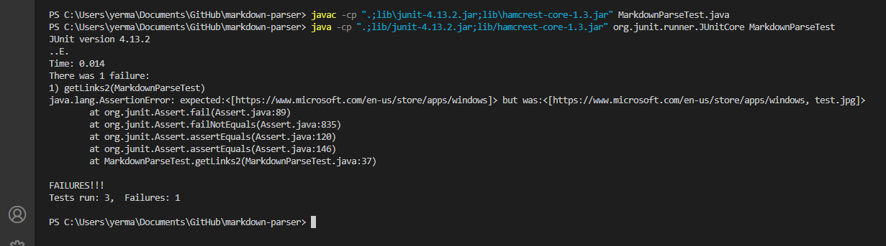
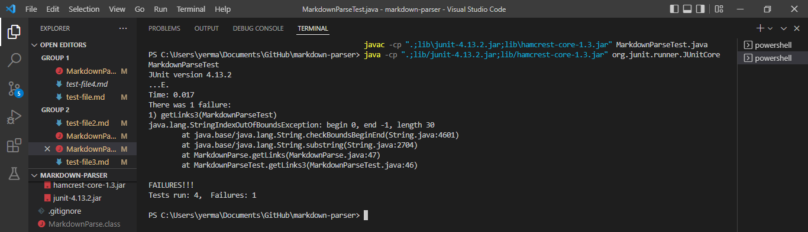
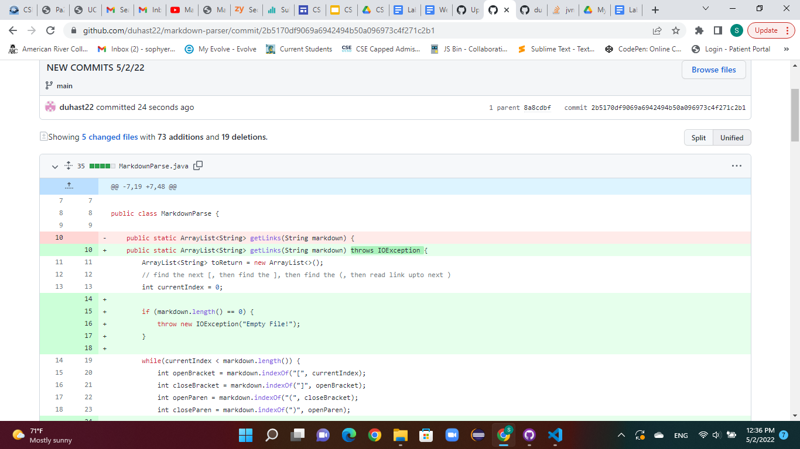

# Lab Report Week 4 - Sophia Yermolenko
## Topic: Bugs, Symptoms, and Failure-Inducing Inputs

---
### 1. [The first failure-inducing file.](test-file1.md)

---

```
# Title

[link1](https://something.com)
[link2](some-thing.html)

```

The following screenshot illustrates the symptom of the failure-inducing input.


The bug results because the program initially fails to account for an edge case of a nonexistent file. The symptom of this bug was the java.nio.file.NoSuchFileException exception being thrown. 

---
### 2. [The second failure-inducing file.](test-file2.md)
---

```
# Test 2

[Link1](https://www.microsoft.com/en-us/store/apps/windows)


```

The following screenshot illustrates the symptom of the second failure-inducing input.



The bug results because the program incorrectly adds a link of an image to the list of links. The prompt stated, *"Write a program that takes a markdown file as a command line argument and then prints out all of the URLs of the links (but not of images) in that file."* The symptom of this bug was the faulty program behavior producing the wrong answer output in the JUnit test (displayed in the screenshot). 

---
### 3. [The third failure-inducing file.](test-file3.md)
---

```
# Title 3

[]link goes here!

```

The following screenshot illustrates the symptom of the failure-inducing input.



The bug results because the program does not correctly index the bracket and parenthesis. The symptom of this bug was the inability of the parser to read the file without the correct markdown link syntax. This test threw an IndexOutOfBoundsException. 

---

Here is a screenshot of the code change diff from Github.



Thank you for reading!