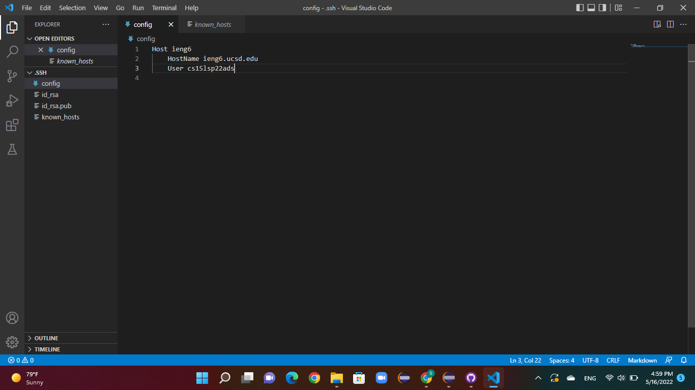
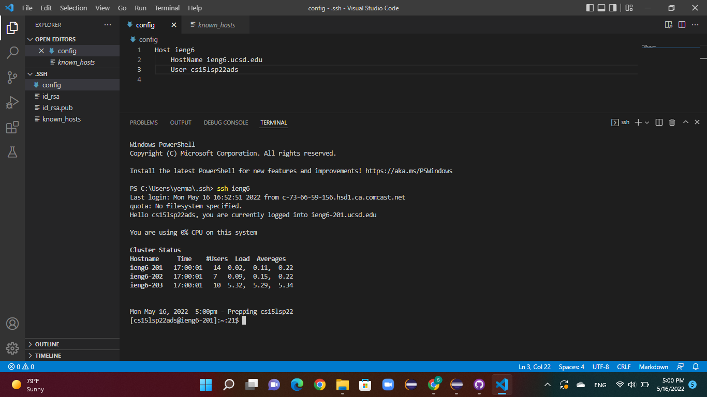
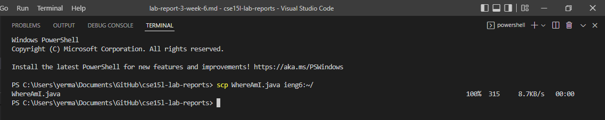
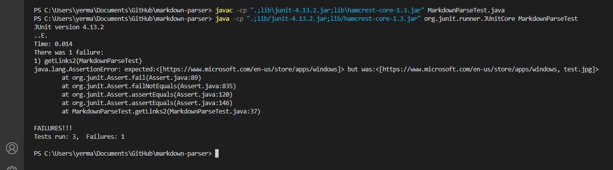
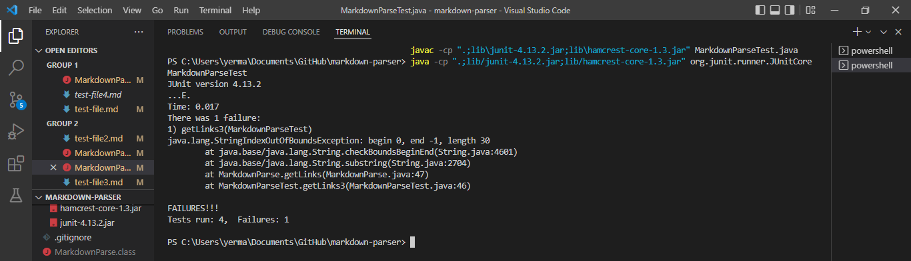
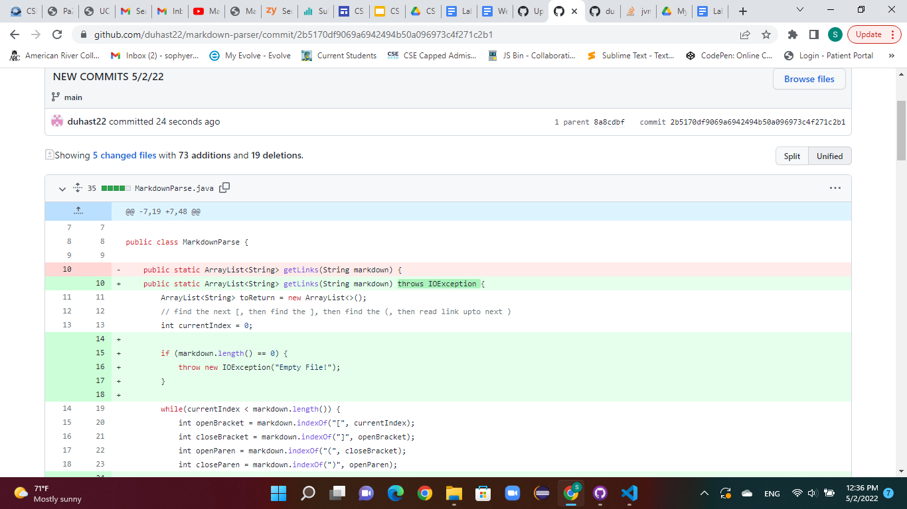

# Lab Report Week 6 - Sophia Yermolenko
## Topic: Streamlining ssh Configuration, Setup Github Access from ieng6, Copy whole directories with `scp -r`

---
### 1. Streamlining ssh Configuration

I added an extra file into the .ssh folder which already contained id_rsa and known_hosts. I called this file config and added the following into it.

```
Host ieng6
    HostName ieng6.ucsd.edu
    User cs15lsp22ads
```
Then I used the `ssh ieng6` command and was able to use the key to log me in with the username `ieng6` which I specified using my public key.

The screenshot below shows the .ssh/config file edited with VSCode.



The next screenshot shows the ssh command that logged me in using the username I chose.



The last screenshot shows the scp command `scp WhereAmI.java ieng6:~/` which copies a file to my account.



---
### 2. Setup Github Access from ieng6
---

```
# Test 2

[Link1](https://www.microsoft.com/en-us/store/apps/windows)


```

The following screenshot illustrates the symptom of the second failure-inducing input.



The bug results because the program incorrectly adds a link of an image to the list of links. The prompt stated, *"Write a program that takes a markdown file as a command line argument and then prints out all of the URLs of the links (but not of images) in that file."* The symptom of this bug was the faulty program behavior producing the wrong answer output in the JUnit test (displayed in the screenshot). 

---
### 3. Copy whole directories with `scp -r`
---

```
# Title 3

[]link goes here!

```

The following screenshot illustrates the symptom of the failure-inducing input.



The bug results because the program does not correctly index the bracket and parenthesis. The symptom of this bug was the inability of the parser to read the file without the correct markdown link syntax. This test threw an IndexOutOfBoundsException. 

---

Here is a screenshot of the code change diff from Github.



Thank you for reading!
