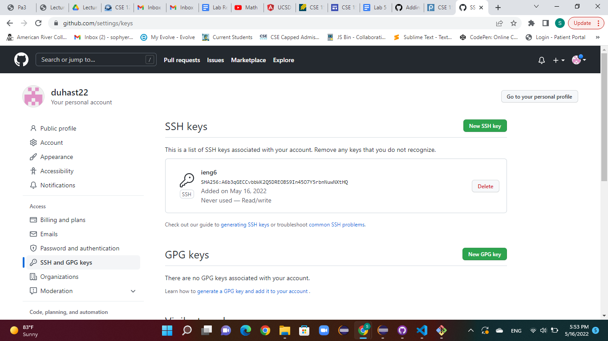
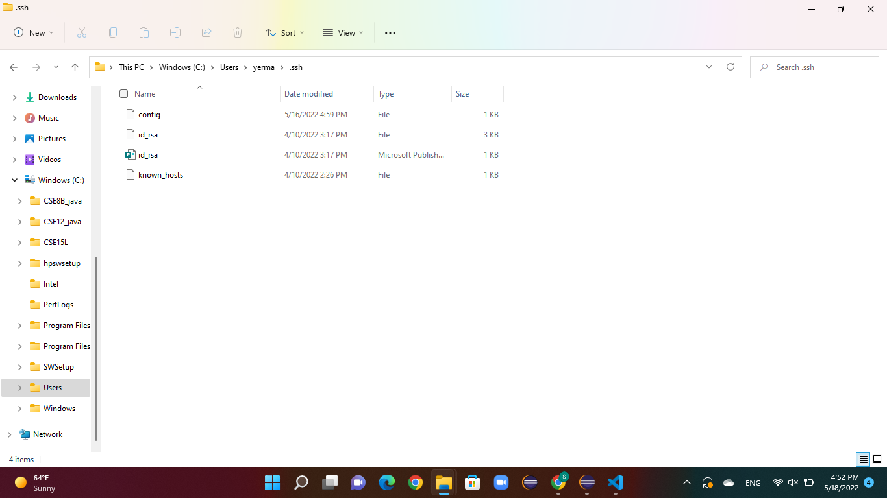
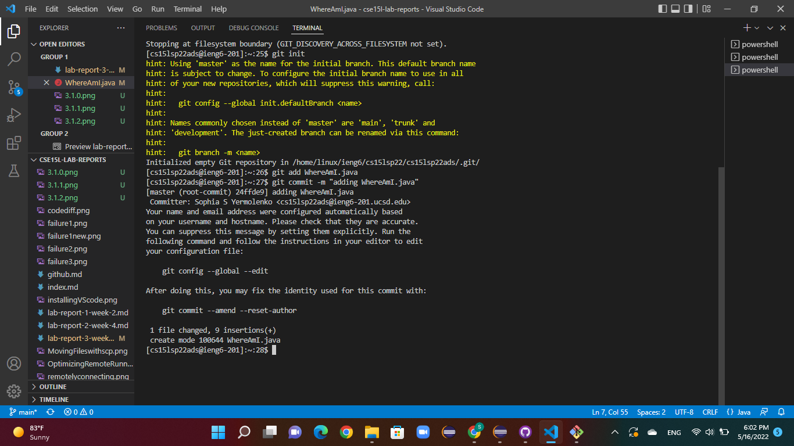
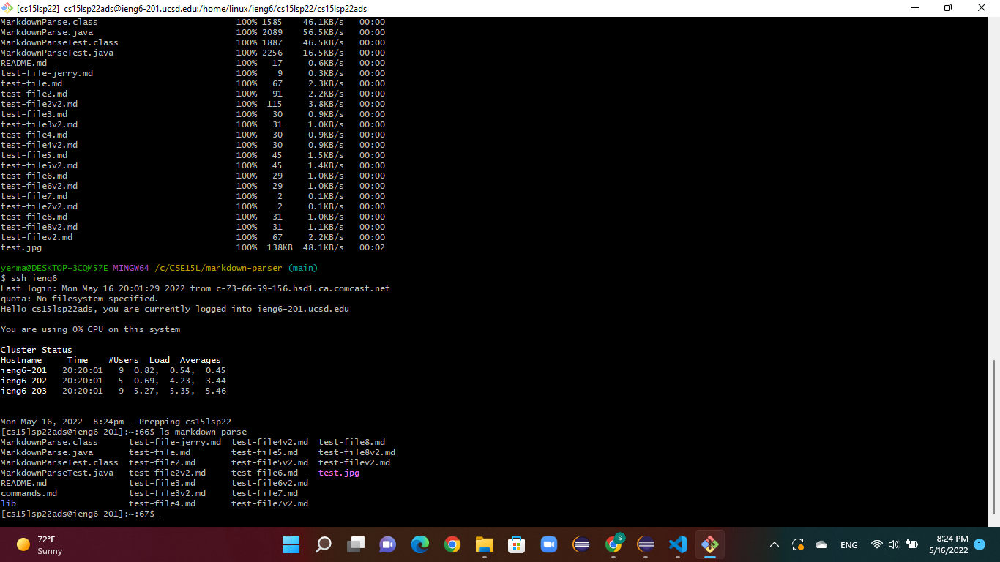

# Lab Report 3 Week 6 - Sophia Yermolenko
## Topic: Streamlining ssh Configuration, Setup Github Access from ieng6, Copy whole directories with `scp -r`

---
### 1. Streamlining ssh Configuration

I added an extra file into the .ssh folder which already contained id_rsa and known_hosts. I called this file config and added the following into it.

```
Host ieng6
    HostName ieng6.ucsd.edu
    User cs15lsp22ads
```
Then I used the `ssh ieng6` command and was able to use the key to log me in with the username `ieng6` which I specified using my public key.

The screenshot below shows the .ssh/config file edited with VSCode.


The next screenshot shows the ssh command that logged me in using the username I chose.


The last screenshot shows the scp command `scp WhereAmI.java ieng6:~/` which copies a file to my account.


---
### 2. Setup Github Access from ieng6
---

The following screenshot shows the public key I made which is stored on Github and in my user account.



The private key is stored on my local machine in the directory `C:\Users\yerma\.ssh`

This screenshot shows where the private key is stored on my machine.



This screenshot illustates running git commands to commit and push a change to Github while logged into my ieng6 account.




[Here is the link for the resulting commit.](https://github.com/duhast22/ieng6/commit/7ac926e2cf78c57266bc5ae6e692006f3b105916)


---
### 3. Copy whole directories with `scp -r`
---

The following screenshot illustrates copying down my whole markdown-parse directory into my ieng6 account.



Unfortunately, I was not able to run the JUnit tests in my ieng6 account.

---

Thank you for reading!
