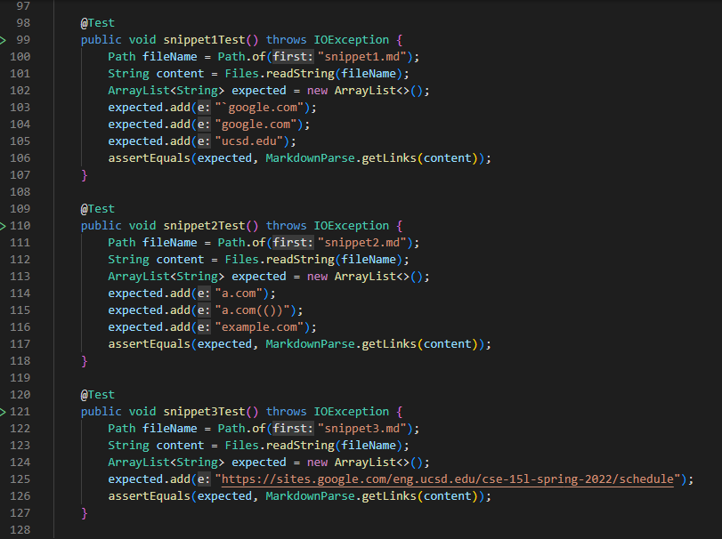
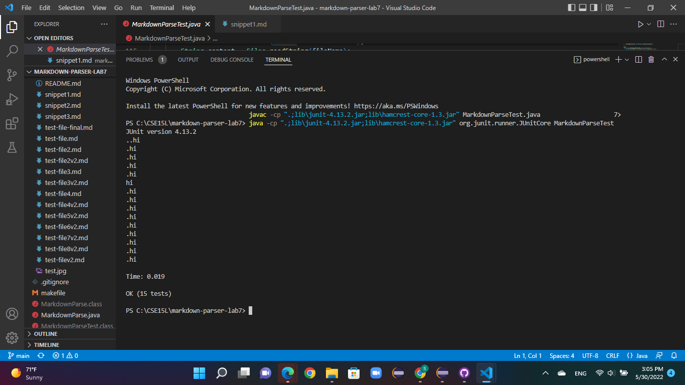

# Lab Report 4 Week 8 - Sophia Yermolenko
## Topic: Testing Implementations

---
### [A link to my markdown-parse repository](https://github.com/httrieu/markdown-parser)

### [A link to the reviewed repository](https://github.com/aaronchan32/markdown-parser)

For every test detailed in the lab report 4 instructions, I wrote a test in MarkdownParseTest.java.

This is the failure for the implementation in my repository. The following screenshot illustrates the specific part of the JUnit output that shows the test failure.

For the implementation I reviewed in Week 7, the corresponding output when running the tests in JUnit shows that all of the tests passed.

---
### Answer the following questions with 2-3 sentences each:
---

1) Do you think there is a small (<10 lines) code change that will make your program work for snippet 1 and all related cases that use inline code with backticks? If yes, describe the code change. If not, describe why it would be a more involved change.

- The issue with snippet 1 is that there are back ticks scattered throughout the links in the md file. In order to fix this issue, it is necessary to add an additional statement to account for the back ticks.

---
2) Do you think there is a small (<10 lines) code change that will make your program work for snippet 2 and all related cases that nest parentheses, brackets, and escaped brackets? If yes, describe the code change. If not, describe why it would be a more involved change.

- The issue with snippet 2 is that there are extra parentheses and brackets that may break the MarkdownParse. One way to fix this error is to add an additional if statement to make sure that MarkdownParse only reads the outside parentheses and brackets.

---
3) Do you think there is a small (<10 lines) code change that will make your program work for snippet 3 and all related cases that have newlines in brackets and parentheses? If yes, describe the code change. If not, describe why it would be a more involved change.

- The issue with snippet 3 is that there is an incomplete link implementation and also new lines that are added throughout the file. I do not think there is a small code change that can be done in this case. This change would have to write an additional if statement that would account for newlines in brackets and parenthesis and would explore the correct implementation.

---

Thank you for reading!

